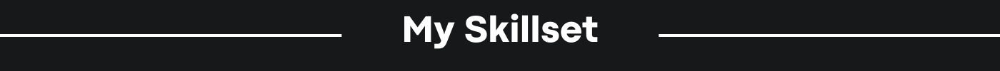
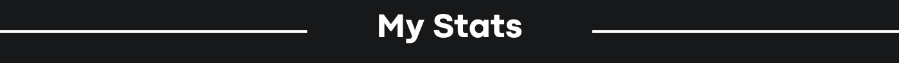
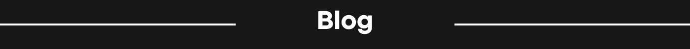
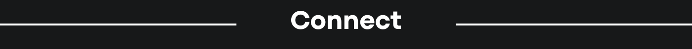

  

  

Hi, I'm Isaac a student currently studying Computer Science and Artificial Intelligence at North Carolina State University. I'm focused in machine learning with additional experience in front end and back end development.
  
  

   

 

 

<table><tr><td valign="top" width="33%">

### Frontend  

  
  
  
  
  
  
  
  
  

</td><td valign="top" width="33%">

### Backend  

  
  
  
  
  
  
  
  
  
  

</td><td valign="top" width="33%">

### DevOps  

  
  
  
  
  
  
  
  
  

</td></tr></table> 

 

    

  

 

 
   

 

 

 

  

 

  

  

  

  
  

   
